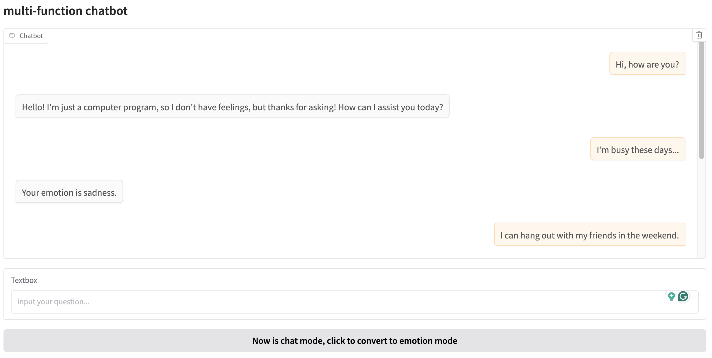
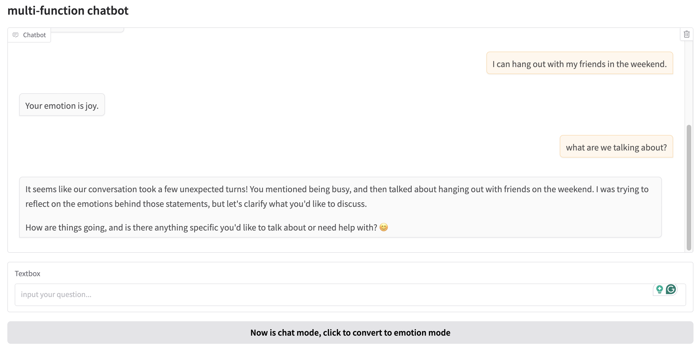

# Here's the draft chatbot simply built on Gradio

A button to control the `chat` mode or `emotion` mode.

`chat mode`: Based on qwen API

`emoton mode`: Based on pretrained [j-hartmann/emotion-english-distilroberta-base](https://huggingface.co/j-hartmann/emotion-english-distilroberta-base), a emotion cls model based on distilroberta.

