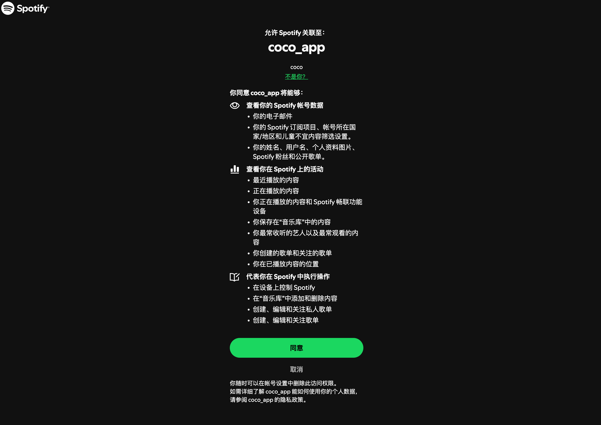
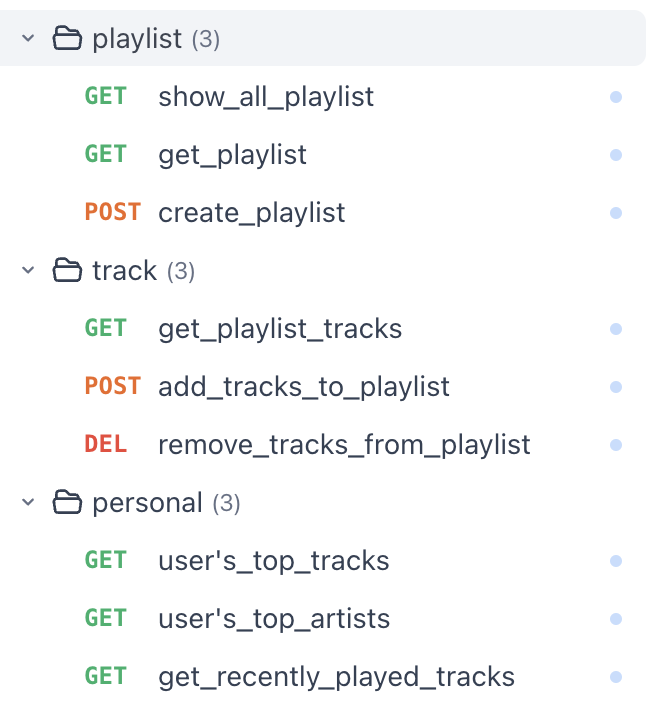

# Here are the basic spotify api integration






```
src
├── app.py
├── auth
│   └── auth.py
├── dtos
│   └── api.py
├── routers
│   ├── personal.py
│   ├── playlist.py
│   └── track.py
└── services
    ├── spotify.py
    └── utils.py
```

The backend builds with `FastAPI`, some basic apis above are supported, including auth, user's playlist and track operation, and time-relatived personal information extraction.

